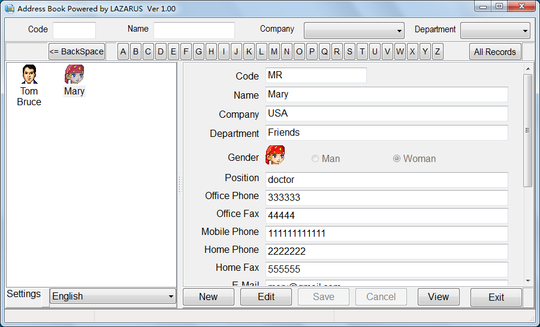
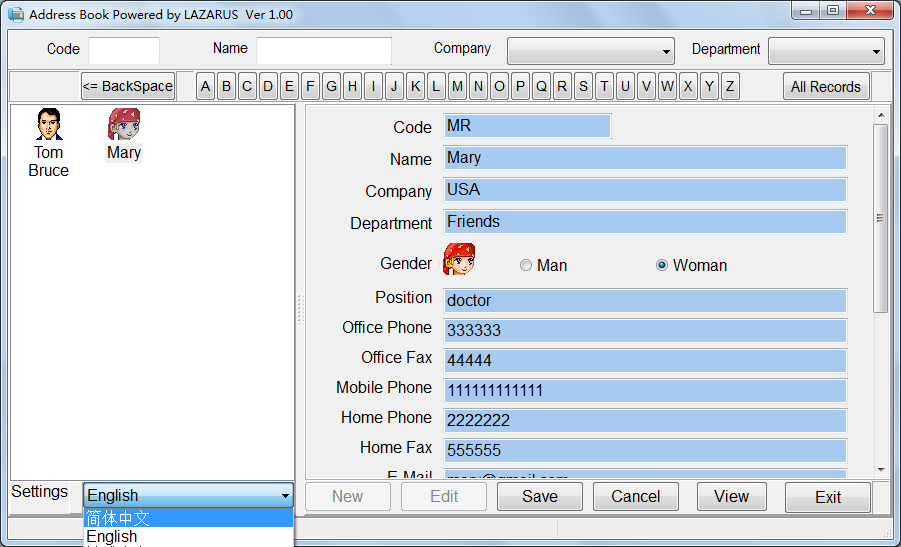
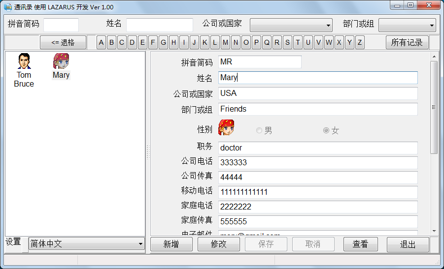
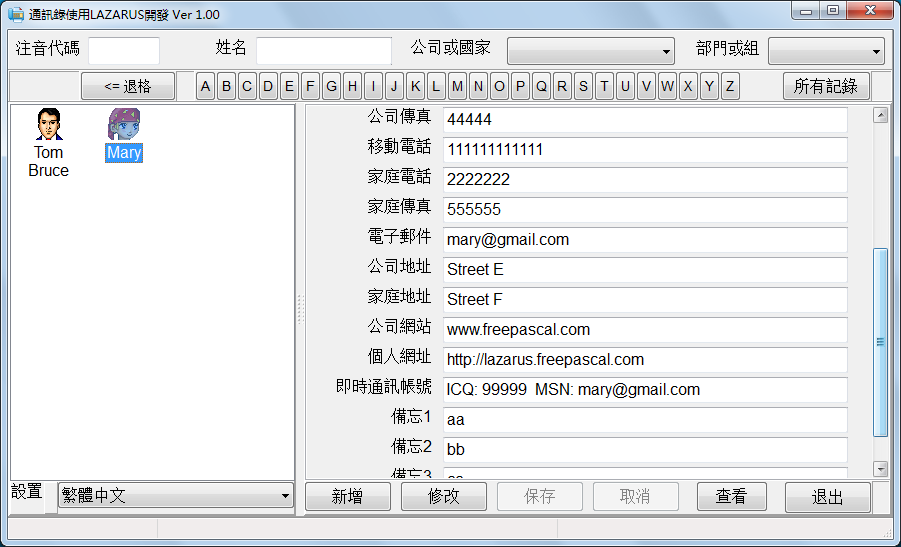
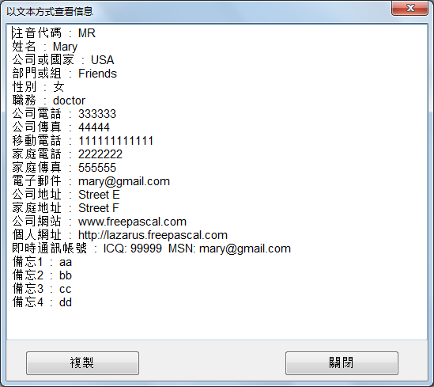

lazarus_address_book
====================

一个使用lazarus开发的通讯录程序，全部源码开放

#摘要
使用lazarus1.24 开发的通讯录程序。    
lazarus官网是：[http://www.lazarus.freepascal.org/](http://www.lazarus.freepascal.org/ "Lazarus官网")  
lazarus中文论坛官网是： [http://www.fpccn.com](http://www.fpccn.com "lazarus中文论坛官网")  
作者的博客： [http://www.best-apps-now.com](http://www.best-apps-now.com "腾达格尔的博客")
#版权说明

  本软件完全开源，但修改或引用要注明出处。

#主要功能

+ 支持拼音简码、姓名、部门（组）检索。
+ 使用sqlite数据库
+ 支持简体中文、繁体中文、英文

#windows编译发行版本，可直接下载使用

在压缩文件 **0_addressbook_release_exe.zip**  之中。

##编译发行版目录及文件说明  
###Release
    + data        目录，存放sqlite数据库文件
    + locale      目录，存放简体中文、繁体中文本地菜单文件
    + snap_shot   目录，存放软件截图
    + address_book.exe  通讯录主程序
    + Conf.ini          配置文件，不必修改  
    + sqlite3.dll       sqlite动态库

##lazarus工程文件  
   address_book.lpi
    

#软件截图

  
  
  
  

  